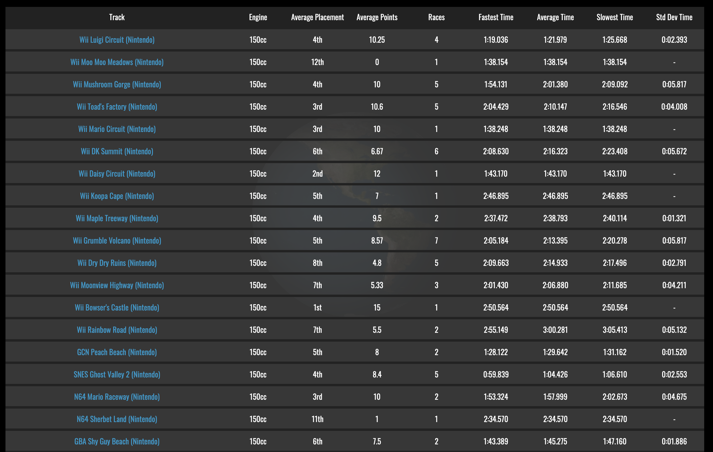

<h1 style="text-align:center;font-family:Gill Sans, sans-serif">CS5394 Project4</h1>

<h2 style="color:dodgerblue;">Mario Kart Wii Mogi Lounge MMR predictor </h1>
<h4>Background Info</h4>

<p style="font-family:courier;">Mario Kart Wii is one of my favorite games and has been for over 10 years.</p>
<p style="font-family:courier;">With the evolulion of the game a competetive comunity has formed and there are thousands of players playing daily.</p>
<p style="font-family:courier;">There are 32 track in the game nativly and you can see your statistics on all the tracks through the matches you have played</p>
<p style="font-family:courier;">My goal was to make and train a model to predict a players mmr based on their<ul style=" font-family:courier;"><li>Average Placement</li><li>Fastest Time</li><li>Number of Times played</li></ul></p>


<p>These elements were chosen because they are quickly accesible for all players using the command <br><code style="font-size330%;">?besttracks rt</code> in the main community discord server.</p>

<h4>Data Retrieval</h4>
<p style="font-family:courier;">The data for all the races is held in a private  data base, and while I am in contact with the administrators to potentially have access to this data in the future I was not able to for this project.</p>
<p style="font-family:courier;">To circumvent this I used the lounge website as my datasource and used bs4 to web scrape from each indiviuduals page.</p>
<p style="font-family:courier;">Here is my page that I webscraped
this conatins my data and is updated every hour.</p>

<p style="font-family:courier;">using Beautiful Soup 4 I webscraped every players page and put it into a pandas dataframe along with their current mmr(match making rank)

<h4>Modeling Process</h4>
<p style="font-family:courier;">I tried many different models with both classifers and regressors and after many RandomsearchCVs i landed on a random forest regressor with parameter <code>{'n_estimators': 1600,
 'min_samples_split': 5,
 'min_samples_leaf': 1,
 'max_features': 'sqrt',
 'max_depth': 70,
 'bootstrap': False}</code> which gave the lowest rmse. I use the previously collected data for fit the model, but I put functions in the app to update the data when necesary, but it takes a few minutes so i dont have it reoccuring</p>
 <h4>Using the app</h4>
 <p style="font-family:courier;">For my MKW players simply use the command <code>?bt rt</code> in the lounge server and copy the results into the text are</p>
 <p style="font-family:courier;">For those who dont play lounge but want to see it work I will attachs some sample data to try. Scroll left for my data.</p>
 <table>
<tr>
<th>Random Data</th>
<th>My Data</th>
</tr>
<tr>
<td>
  
```
+ Track Name                   Avg Pts    Avg Place    Best Time    # Plays
---------------------------  ---------  -----------  -----------  ---------
1.  DS Yoshi Falls               11.00         2.75         1:09          4
2.  Mario Circuit                 9.00         5.00         1:32          3
3.  Bowser's Castle               8.32         4.79         2:34         19
4.  GCN Mario Circuit             8.00         4.00         1:50          1
5.  GBA Shy Guy Beach             8.00         4.00         1:42          1
6.  DS Desert Hills               7.50         5.50         1:55          2
7.  Luigi Circuit                 7.44         5.56         1:18          9
8.  Coconut Mall                  7.44         5.50         2:11         16
9.  N64 DK's Jungle Parkway       6.78         5.78         2:34          9
10. SNES Ghost Valley 2           6.62         6.00         0:58          8
11. Grumble Volcano               6.52         5.92         1:60         25
12. Toad's Factory                6.40         6.40         2:03          5
13. DS Delfino Square             6.07         6.20         2:20         15
14. Koopa Cape                    6.06         6.18         2:33         17
15. GCN Waluigi Stadium           5.93         6.64         2:09         14
16. GBA Bowser Castle 3           5.77         6.71         2:28         31
17. Wario's Gold Mine             5.67         6.56         2:08          9
18. Dry Dry Ruins                 5.65         7.00         2:01         23
19. Moonview Highway              5.50         7.05         1:57         22
20. GCN DK Mountain               5.42         6.92         2:18         12
21. Mushroom Gorge                5.23         7.32         1:55         22
22. DS Peach Gardens              5.22         7.22         2:16         18
23. N64 Bowser's Castle           5.22         7.00         2:46         23
24. SNES Mario Circuit 3          4.76         7.53         1:30         17
25. Rainbow Road                  4.50         7.50         2:53          2
26. N64 Sherbet Land              4.10         8.10         2:22         21
27. DK Summit                     4.08         8.25         2:05         12
28. Moo Moo Meadows               4.00         8.00         1:29          5
29. N64 Mario Raceway             4.00         8.00         2:00          1
30. Maple Treeway                 3.60         8.40         2:34          5
31. GCN Peach Beach               3.43         8.71         1:23          7
32. Daisy Circuit                 1.00        11.00         1:46          3
```
  
</td>
<td>

```
+ Track Name                   Avg Pts    Avg Place    Best Time    # Plays
---------------------------  ---------  -----------  -----------  ---------
1.  Daisy Circuit                12.00         2.00         1:43          1
2.  Coconut Mall                 12.00         2.00         2:21          1
3.  Mushroom Gorge               11.25         2.88         1:53          8
4.  N64 DK's Jungle Parkway      10.17         3.33         2:29          6
5.  Mario Circuit                10.00         3.00         1:38          1
6.  Luigi Circuit                10.00         4.00         1:18          6
7.  GCN Waluigi Stadium           9.67         3.67         2:11          6
8.  Toad's Factory                9.22         4.44         2:04          9
9.  SNES Ghost Valley 2           8.40         4.40         0:60          5
10. GCN Peach Beach               8.00         5.00         1:28          2
11. DS Yoshi Falls                8.00         4.00         1:14          1
12. Grumble Volcano               7.60         5.60         2:05         10
13. Koopa Cape                    7.50         4.50         2:41          2
14. Bowser's Castle               7.50         5.83         2:46          6
15. N64 Mario Raceway             7.50         5.00         1:53          4
16. DK Summit                     7.43         5.57         2:09          7
17. N64 Bowser's Castle           7.36         5.64         2:55         11
18. SNES Mario Circuit 3          7.33         5.83         1:32          6
19. DS Desert Hills               7.00         5.00         1:58          1
20. Maple Treeway                 6.80         6.20         2:37          5
21. GBA Bowser Castle 3           6.40         5.70         2:34         10
22. DS Delfino Square             5.71         6.64         2:26         14
23. GCN DK Mountain               5.67         6.33         2:31          6
24. Rainbow Road                  5.50         6.50         2:55          2
25. Moonview Highway              5.33         6.67         2:01          3
26. GBA Shy Guy Beach             5.00         7.50         1:43          4
27. Dry Dry Ruins                 4.62         7.88         2:04          8
28. DS Peach Gardens              3.67         8.50         2:22          6
29. Wario's Gold Mine             2.00        10.00         2:16          1
30. N64 Sherbet Land              1.50        10.50         2:35          2
31. Moo Moo Meadows               1.00        11.00         1:37          2
```

</td>
</tr>
</table>

<h4>What I learned</h4>
<p style = "font-family:courier;"> Most of what I learned was realted to web scraping. I almost gave up on this project when I learned there was no public API for the data, but I am glad I didn't. It was fun to try to extract all the data from the HTML table and format it into a pandas dataframe before I realized pandas did it for you. I also learned some more specifics of each model I tried in order to get the best results possible." 


